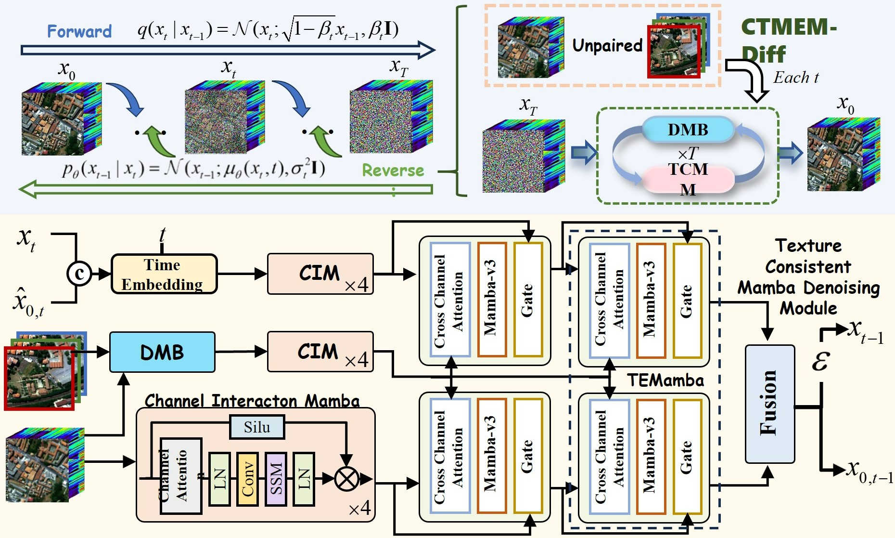

<div align=center>

# **[TGRS]** CTMEM-Diff
<p>
<a href='https://ieeexplore.ieee.org/document/11222103'></a>
</p>

</div>

<div align=center>

</div>

### CTMEM-Diff: A Cross-Modal Texture Matching and Enhancement Mamba Diffusion Model for Unpaired Hyperspectral Image Super-Resolution
Abstract: In the field of hyperspectral image super-resolution (HSI-SR), fusion-based image super-resolution (SR) is a research hotspot different from single image super-resolution (SISR). However, it is common for hyperspectral images (HSI) and multi-spectral images (MSI) to cover different areas and be acquired at different times. Such image pairs pose two challenges to the SR task, which are how to match similar regions of two images and to achieve efficient texture transfer in the complex texture details of remote sensing images. We define this task as unpaired HSI-SR and propose a cross-modal texture matching and enhancement mamba diffusion model (CTMEM-Diff) to solve the above problems. In the framework of the diffusion model, CTMEM-Diff gradually transfers texture details in MSI in an iterative manner to generate high-resolution HSI. Specifically, at each step of the iterative process, we propose a degradation matching block (DMB), which employs different degradation functions for different modal images to convert HSI and MSI to a uniform data dimension to improve the performence of texture matching. In addition, in order to fully utilize the spectral information in HSI, as well as the spatial information in MSI, we design a texture consistent mamba denoising module (TCMM) that utilizes the global context modeling capability and a gating mechanism of mamba to achieve efficient texture transfer. We constructed three datasets based on five publicly available datasets to validate the effectiveness of our model, and the experimental results show that our method achieves optimal results. The source code is available at https://github.com/Jiahuiqu/CTMEM-Diff.
## 🛠 Getting started

### Setup environment

1. install dependencies

```
numpy == 1.24.4
torch == 1.13
causal-conv1d ==1.0.0
mamba-ssm == 1.0.1
scipy == 1.10.1
```

### Prepare dataset
The format of the dataset for the Dataloader in the example is
```angular2html
- root

-- train

---- gtHS
------ 1.mat
------ 2.mat
------ *.mat

---- lrHS
------ 1.mat
------ 2.mat
------ *.mat

---- hrMS
------ 1.mat
------ 2.mat
------ *.mat

-- test

---- gtHS

------ 1.mat
------ 2.mat
------ *.mat

---- lrHS

------ 1.mat
------ 2.mat
------ *.mat

---- hrMS

------ 1.mat
------ 2.mat
------ *.mat
```
You can also change the dataset and the corresponding data loader as needed. 
Make sure that the final return value contains the required HrHSI, LrHSI, and HrMSI.
## 🚀 Train the model

```bash
# Based on the existing HrMSI, the LrMSI is generated
python  ./modelnet/DBM.py

# Based on the generated LrMSI, the spatial degradation function is pre-trained
python ./train_kernel.py

# train model
python test.py
```

## 👍 Additional Information

**Note**

```python
gathered_x = torch.gather(hard_matrix, dim=1, index=hard.unsqueeze(-1).expand(-1, -1, 768*3))
```
The code is located in modelnet/DMB.py under class DMB. 768*3
The meaning of 768 means that the patch size is 16\*16 and the number of channels is 3. 3 means that there are three feature maps.
If you want to change the size of the patch, change the parameter patchsize above.
It is inevitable to change 768 to its corresponding value.


## :e-mail: Contact

If you have any questions, please email [`xuy@stu.xidian.edu.cn`](mailto:xuy@stu.xidian.edu.cn).

